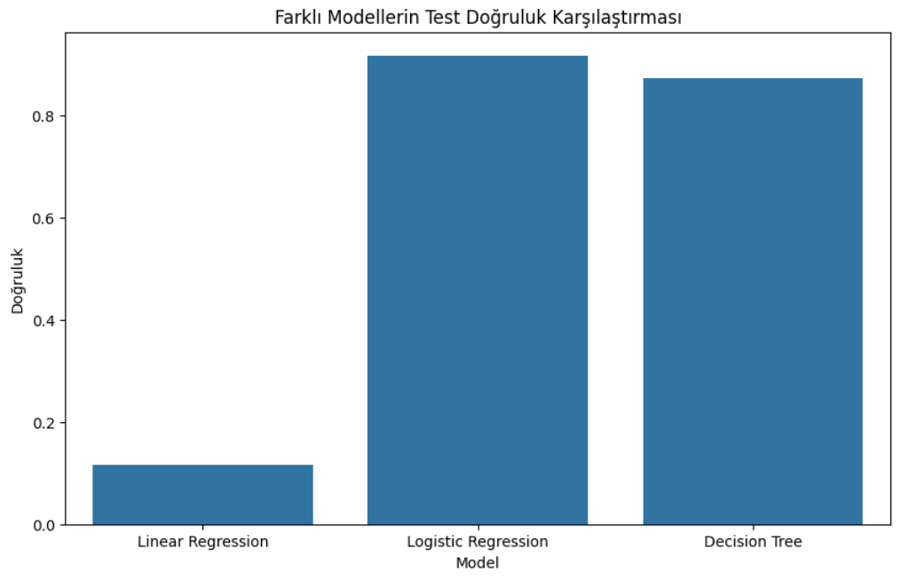
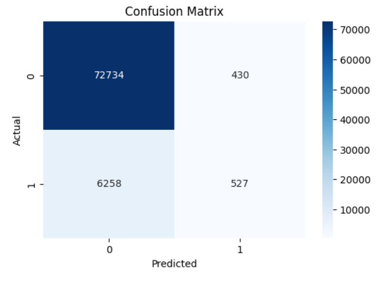
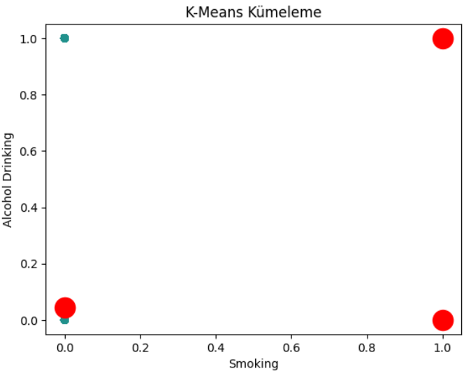

# Heart-Disease-Indicators-Analysis

Veri Seti: https://www.kaggle.com/datasets/kamilpytlak/personal-key-indicators-of-heart-disease
Kaggle: 

## Proje Tanıtımı

Bu proje, kalp hastalığı göstergelerini analiz etmek amacıyla bir makine öğrenimi ve veri analizi süreci içerir. Kullanılan veri seti, kalp hastalığının çeşitli sağlık göstergeleriyle ilişkilendirilmesini sağlar. Proje, veri temizleme, özellik mühendisliği, modelleme ve sonuçların görselleştirilmesi aşamalarını kapsamaktadır.

Veri seti Kaggle'dan temin edilmiştir. Bu veri seti, sağlık göstergeleri ile kalp hastalığı arasındaki ilişkileri incelemek için kullanılmıştır.

## Yöntemler

1. **Veri Temizleme**: Verilerdeki gerekli dönüşümler yapılmıştır.
2. **Özellik Mühendisliği**: Kategorik veriler sayısal verilere dönüştürülmüş ve bazı özellikler çıkarılmıştır.
3. **Kümeleme**: K-means ve Agglomerative Clustering yöntemleri kullanılarak veri kümelere ayrılmıştır.
4. **Modelleme**: Logistic Regression ve Decision Tree gibi sınıflandırma modelleri uygulanmıştır.
5. **Değerlendirme**: Çapraz doğrulama ve performans metrikleri kullanılarak modeller değerlendirilmiştir.

## Sonuçlar

### Model Performansı

Aşağıda, farklı modellerin test doğrulukları ve performans metrikleri bulunmaktadır:

- **Logistic Regression**:
  - Doğruluk: 0.92
  - Kesinlik: 0.55
  - Duyarlılık: 0.08
  - F1 Puanı: 0.14

- **Decision Tree**:
  - Doğruluk: 0.87

- **Linear Regression**:
  - Doğruluk: 0.12

### Confusion Matrix

### Kümeleme Sonuçları

## Kullanılan Kütüphaneler

- `pandas`
- `numpy`
- `matplotlib`
- `seaborn`
- `scikit-learn`
- `mlxtend`
